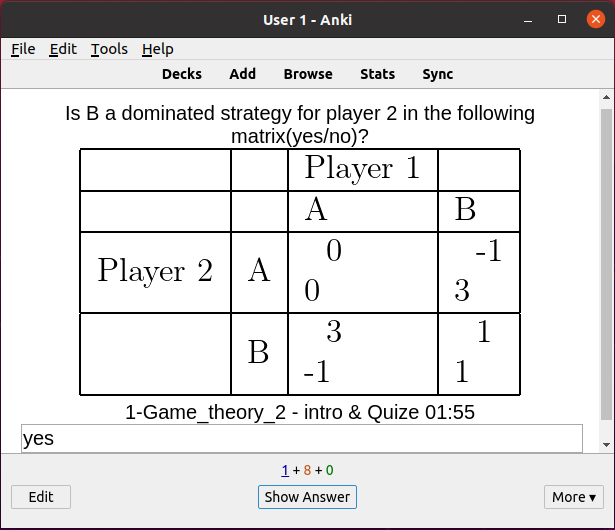

# Memorisation-Anki-course-decks
Anki decks for academic courses to help you memorize and study.

## How to use?
1. Dowload or clone this repository.
2. Download and open Anki, it's open source.
3. Import a "deck=set of flashcards" (e.g. the one in: `SOW-BKI212A-AI: Principles and Techniques 20-21/Multi-agent/Game_theory.apkg`), (flashcard = a memory card, with a question and answer).
4. Start "practicing your memory".
5. If you feel like it, you can `fork=copy`this `repository=folder`, add new flashcards and/or decks and click on `pull request=include my work pls`.

Ps. If you add a question, please include a link or reference to the exact position of the information that can be used to answer/answers your question.
Ps. If you add a question, please include an explanation in the field named: `explanation`.

## Why?
Exams are supposed to be about understanding not memory. In my experience, some basic facts/"knowledge" is required to be able to interpret (and often succesfully answer) exam questions. Additionally, in my experience I have found I was a bit lazy in doing the work to memorize the required facts, hence forcing myself to do the (deck-creating and practicing) work with Anki increases my understanding and helps me identify some ambiguities/doubts/memory-weaknesses.

